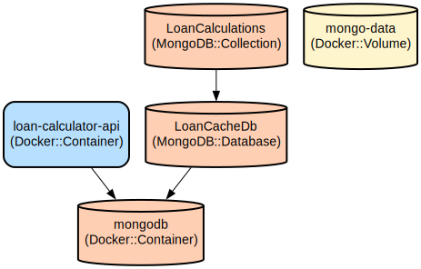

# Loan Calculator: A Modern Web Application for Accurate Loan Payment Calculations

A full-stack web application that provides precise loan calculations with real-time interest rates from the Bank of Israel. The application offers both fixed payment (Shpitzer) and fixed principal calculation methods, interactive payment schedules, and visual representations of loan breakdowns.

The application combines an Angular frontend with a .NET Core backend, utilizing MongoDB for caching calculations. It features real-time interest rate updates, interactive payment schedules, and comprehensive visualization tools to help users understand their loan terms. The application supports server-side rendering for improved performance and SEO capabilities.

## Repository Structure
```
.
├── loan-calculator-ui/          # Angular frontend application
│   ├── src/                    # Source code for the Angular application
│   │   ├── app/               # Core application components and services
│   │   └── environments/      # Environment-specific configuration
│   ├── e2e/                   # End-to-end tests using Selenium WebDriver
│   └── Dockerfile             # Container configuration for UI
├── src/                        # .NET Core backend application
│   └── demo/                  # Main backend application code
│       ├── Controllers/       # API endpoints for loan calculations and interest rates
│       ├── Models/           # Data models for loans and interest rates
│       ├── Services/         # Business logic and external services
│       └── Dockerfile        # Container configuration for API
└── docs/                      # Documentation and infrastructure diagrams
```

## Usage Instructions
### Prerequisites
- Node.js 16.x or later
- .NET SDK 8.0 or later
- Docker and Docker Compose
- MongoDB 6.0 or later
- Chrome browser (for E2E tests)

### Installation

#### Backend (.NET Core API)
```bash
# Clone the repository
git clone <repository-url>

# Navigate to the API directory
cd src/demo

# Restore dependencies
dotnet restore

# Start the API (development)
dotnet run
```

#### Frontend (Angular)
```bash
# Navigate to the UI directory
cd loan-calculator-ui

# Install dependencies
npm install

# Start the development server
npm start
```

#### Using Docker Compose
```bash
# Start all services
docker-compose up -d

# Stop all services
docker-compose down
```

### Quick Start
1. Start the backend API and MongoDB:
```bash
cd src/demo
docker-compose up -d
```

2. Start the frontend application:
```bash
cd loan-calculator-ui
npm start
```

3. Open your browser and navigate to `http://localhost:4200`

### More Detailed Examples

#### Calculating a Fixed Payment Loan
```typescript
// Using the loan calculator service
const loanRequest = {
  loanAmount: 100000,
  interestRate: 5.5,
  termInYears: 30,
  calculationMethod: 'Shpitzer'
};

// The service will return a detailed payment schedule
const result = await loanService.calculateLoan(loanRequest);
```

#### Fetching Current Interest Rates
```typescript
// Using the interest rate service
const mortgageRates = await interestRateService.getMortgageRates();
const loanRates = await interestRateService.getLoanRates();
```

### Troubleshooting

#### API Connection Issues
If you encounter API connection errors:
1. Verify the API is running: `curl http://localhost:5062/api/health`
2. Check CORS settings in `Program.cs`
3. Verify proxy configuration in `proxy.conf.json`

#### MongoDB Connection Issues
1. Verify MongoDB is running: `docker ps | grep mongodb`
2. Check connection string in `appsettings.Development.json`
3. Ensure MongoDB port (27017) is accessible

#### E2E Test Failures
1. Ensure both API and UI are running
2. Check Chrome WebDriver installation
3. Run tests with debug logging:
```bash
DEBUG=true npm run e2e
```

## Data Flow
The application processes loan calculations through a multi-step pipeline, from user input validation to payment schedule generation and caching.

```ascii
[User Input] -> [Angular UI] -> [.NET API] -> [Calculation Engine]
                                     |              |
                                     v              v
                              [MongoDB Cache] <- [Payment Schedule]
                                     |              |
                                     v              v
                              [Interest Rates] -> [Visual Charts]
```

Key component interactions:
1. UI collects loan parameters and validates input
2. API processes calculation requests and caches results
3. MongoDB stores calculation results for quick retrieval
4. Interest rate service fetches real-time rates from Bank of Israel
5. Payment schedule generator creates detailed amortization tables
6. Chart components visualize payment breakdowns
7. Server-side rendering improves initial page load performance

## Infrastructure



### Docker Containers
- `mongodb`: MongoDB 6.0 container for caching loan calculations
- `loan-calculator-api`: .NET Core API container

### Volumes
- `mongo-data`: Persistent storage for MongoDB data

### Databases
- `LoanCacheDb`: MongoDB database for caching loan calculations
  - Collection: `LoanCalculations` - Stores calculated loan schedules

### Network Configuration
- API exposed on port 8080
- MongoDB exposed on port 27017
- Angular development server on port 4200